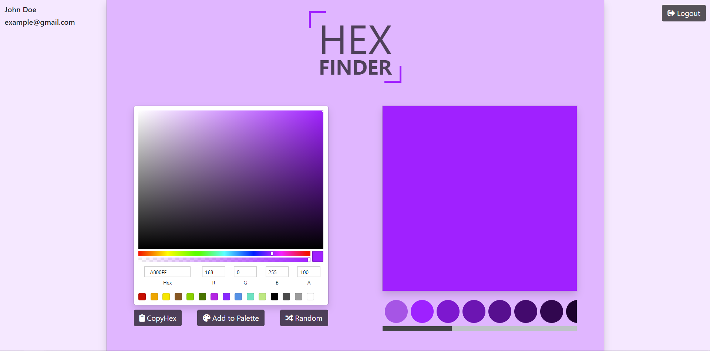

<!-- PROJECT LOGO -->
<br />
<p align="center">
  <a href="https://hex-finder.herokuapp.com/">
    
  </a>
</p>

Interactive tool to create palettes and get color codes in the Hexadecimal and or RGBA format. Palettes of registered users are saved onto a database, so that they can refer to it multiple times without losing any colors.

Can be used along with HTML/CSS to design websites.

## Motivation

To learn more about Full-Stack web development and user Authentication/Authorization, via the PERN stack and JSON Web Token.

## Features

- **Color Picker**: displaying HEX/RGBA values of a selected color.
- **Checkboard Component**: displaying the color, including opacity.
- **Palette**: Collection of all selected colors.
- **CopyHex**: Copies hex to clipboard.
- **Random**: Randomly generates a color.
- Dynamic User Interface.

## Built With

This project was built using the PERN stack, which includes:

- [PostgreSQL](https://www.postgresql.org/)
- [Express.js](https://expressjs.com/)
- [React](https://reactjs.org/)
- [Nodejs](https://nodejs.org/en/)

**React** was used for Front-End Development, along with [Bootstrap](https://getbootstrap.com).\
**Express.js** and **PostgreSQL** were used to implement the RESTful API.\
[JSON Web Token](https://nodejs.org/en/) was used for user authentication/authorization.

## Installation

```bash
# get the project
$ git clone https://github.com/shivamp08/pern-hex-finder

# install dependencies
$ npm install

# run start (using react-scripts - default port: 5000)
$ npm start

```

## Screenshot


